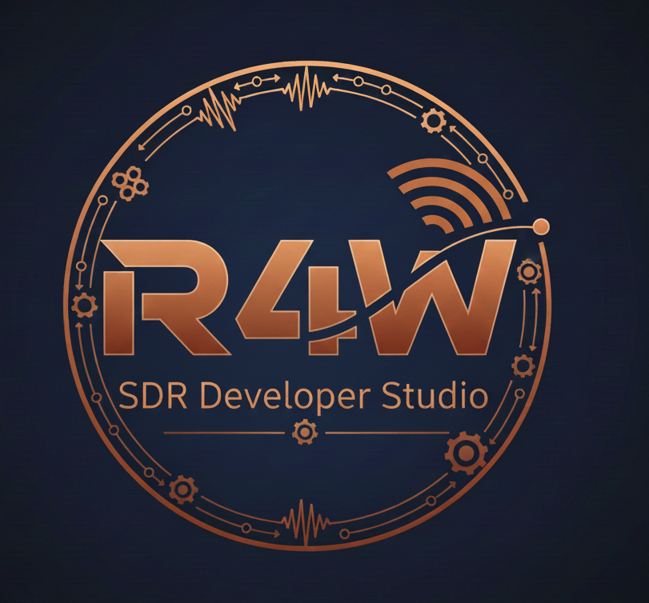

# R4W - Rust for Waveforms



Powered by  - a Joe Mooney/Claude Code Production


[](LICENSE)
[](https://www.rust-lang.org)

**A platform for developing, testing, and deploying SDR waveforms in Rust.**

```
    ██████╗ ██╗  ██╗██╗    ██╗
    ██╔══██╗██║  ██║██║    ██║
    ██████╔╝███████║██║ █╗ ██║     Rust 4 Waveforms
    ██╔══██╗╚════██║██║███╗██║     SDR Developer Studio
    ██║  ██║     ██║╚███╔███╔╝
    ╚═╝  ╚═╝     ╚═╝ ╚══╝╚══╝
```

## Features

- **42+ Waveforms**: CW, OOK, ASK, FSK, PSK, QAM, OFDM, LoRa, DSSS, FHSS, SINCGARS, HAVEQUICK, Link-16, P25, TETRA, DMR, 3G-ALE, GNSS (GPS, GLONASS, Galileo), and more
- **Waveform Wizard**: Interactive GUI for designing waveforms with AI-assisted implementation
- **Cross-Platform**: x86 Linux, ARM, macOS, Windows, WebAssembly, FPGA, Xilinx Zynq, Lattice
- **Security & Isolation**: 8-level waveform isolation from process sandboxing to air-gapped systems
- **Educational GUI**: Interactive visualization of modulation and signal processing
- **Production CLI**: Benchmarking, remote agents, UDP I/Q streaming
- **FPGA Ready**: Designed for Xilinx Zynq and Lattice acceleration

## Quick Start

```bash
# Clone the repository
git clone https://github.com/joemooney/r4w
cd r4w

# Run the GUI explorer
cargo run --bin r4w-explorer

# List available waveforms
cargo run --bin r4w -- waveform --list

# Simulate a LoRa transmission
cargo run --bin r4w -- simulate --message "Hello R4W!" --snr 10.0

# Run in browser (WebAssembly)
cd crates/r4w-web && trunk serve
```

## Crates

| Crate | Description |
|-------|-------------|
| **r4w-core** | Core DSP algorithms, waveform trait, FFT, FEC, coding |
| **r4w-sim** | Channel simulation (AWGN, Rayleigh, Rician), scenario engine, UDP transport |
| **r4w-fpga** | FPGA acceleration (Xilinx Zynq, Lattice iCE40/ECP5) |
| **r4w-sandbox** | Waveform isolation (process, container, hardware separation) |
| **r4w-gui** | Educational visualization application (egui) |
| **r4w-cli** | Command-line tool: `r4w` |
| **r4w-web** | WebAssembly entry point for browser deployment |

## Available Waveforms

```
Simple:       CW, OOK, PPM, ADS-B
Analog:       AM-Broadcast, FM-Broadcast, NBFM
Amplitude:    ASK, 4-ASK
Frequency:    BFSK, 4-FSK
Phase:        BPSK, QPSK, 8-PSK
QAM:          16-QAM, 64-QAM, 256-QAM
Multi-carrier: OFDM
Spread:       DSSS, DSSS-QPSK, FHSS, LoRa (SF7-SF12)
IoT/Radar:    Zigbee (802.15.4), UWB, FMCW
HF/Military:  STANAG 4285, ALE, 3G-ALE, MIL-STD-188-110
              SINCGARS*, HAVEQUICK*, Link-16*, P25*
PMR:          TETRA, DMR (Tier II/III)
GNSS:         GPS L1 C/A, GPS L5, GLONASS L1OF, Galileo E1
```

**\* Framework implementations** - These waveforms use a trait-based architecture where classified/proprietary components (frequency hopping algorithms, TRANSEC, voice codecs) are represented by simulator stubs. The unclassified signal processing, modulation, and framing are fully implemented. See [docs/PORTING_GUIDE_MILITARY.md](docs/PORTING_GUIDE_MILITARY.md) for details on implementing operational versions.

## Performance vs GNU Radio

R4W outperforms GNU Radio on key DSP operations while providing memory safety guarantees:

| Operation | R4W | GNU Radio | Speedup |
|-----------|-----|-----------|---------|
| **FFT 1024-pt** | 371 M samples/sec | 50 M samples/sec | **7.4x faster** |
| **FFT 4096-pt** | 330 M samples/sec | 12 M samples/sec | **27x faster** |
| **FFT 2048-pt** | 179 M samples/sec | ~25 M samples/sec | **7x faster** |

*Benchmarks: R4W with rustfft on Linux. GNU Radio baseline: i7-10700K, FFTW3+VOLK.*

```bash
# Run the comparison benchmark
cargo bench -p r4w-core --bench gnuradio_comparison
```

**Why is R4W faster?**
- rustfft is highly optimized for Rust's memory model
- Zero-copy buffer management with lock-free primitives
- Cache-friendly data structures with 64-byte alignment
- No Python/SWIG overhead in the signal processing path

## C/C++ Integration (Phase 4 Complete ✓)

R4W provides complete C/C++ interoperability for teams migrating from GNU Radio:

```cpp
#include <r4w.hpp>

// RAII C++ wrappers - no manual memory management
auto waveform = r4w::Waveform::bpsk(48000.0, 1200.0);
auto samples = waveform.modulate({1, 0, 1, 1, 0, 0, 1, 0});

// LoRa support
auto lora = r4w::Waveform::lora(7, 125000, 125000.0);

// FFT operations
r4w::FFT fft(1024);
fft.forward(samples);
```

| Component | Status |
|-----------|--------|
| C headers (cbindgen) | ✓ `include/r4w.h` |
| C++ RAII wrappers | ✓ `include/r4w.hpp` |
| CMake integration | ✓ `cmake/FindR4W.cmake` |
| Example programs | ✓ `examples/c/` |

```bash
# Build the FFI library
cargo build -p r4w-ffi --release

# Use from CMake
find_package(R4W REQUIRED)
target_link_libraries(my_app R4W::r4w)
```

## Why Rust for SDR?

| Feature | Benefit |
|---------|---------|
| **Memory Safety** | No buffer overflows in signal processing |
| **Zero-Cost Abstractions** | High-level APIs with C-level performance |
| **Fearless Concurrency** | Safe parallel DSP processing |
| **Cross-Compilation** | Single codebase for ARM, x86, WASM |
| **SIMD Support** | Vectorized operations |
| **No Runtime** | Predictable real-time behavior |

## Security & Waveform Isolation

For deployments requiring separation between waveforms (e.g., classified/unclassified, encrypted/plaintext), R4W provides the **r4w-sandbox** crate with 8 isolation levels:

| Level | Isolation | Turn-Key? | Use Case |
|-------|-----------|-----------|----------|
| L1 | Rust memory safety | ✅ Yes | Development, testing |
| L2 | Linux namespaces | ✅ Yes | Multi-tenant, privilege separation |
| L3 | Seccomp + LSM | ✅ Yes | Government, defense contractors |
| L4 | Containers | ✅ Templates | Cloud deployments |
| L5 | MicroVM (Firecracker) | 📋 Config | High-assurance cloud |
| L6 | Full VM (KVM/QEMU) | 📋 Config | Certification requirements |
| L7 | Hardware isolation | 🔧 Setup | FPGA partitions, CPU pinning |
| L8 | Air gap | 🔧 Setup | Classified operations |

**Turn-key features** (no additional infrastructure):
- Secure memory buffers with automatic zeroization
- Process isolation with namespace separation
- Syscall filtering with DSP-optimized seccomp profiles
- Shared memory IPC for isolated waveform communication
- FPGA partition isolation with AXI firewalls

```rust
use r4w_sandbox::{Sandbox, IsolationLevel};

// Create isolated sandbox for sensitive waveform
let sandbox = Sandbox::builder()
    .isolation_level(IsolationLevel::L3_LSM)
    .waveform("SINCGARS")
    .memory_limit(256 * 1024 * 1024)
    .build()?;

sandbox.run(|| {
    // Waveform runs with syscall filtering and LSM enforcement
    process_classified_signal(&samples);
})?;
```

See [docs/ISOLATION_GUIDE.md](docs/ISOLATION_GUIDE.md) for comprehensive isolation architecture and [docs/SECURITY_GUIDE.md](docs/SECURITY_GUIDE.md) for security best practices.

## Remote Lab (Distributed Testing)

Deploy R4W agents to Raspberry Pis for distributed TX/RX testing:

```bash
# Cross-compile for ARM64
make build-cli-arm64

# Deploy to Raspberry Pis
make deploy-both TX_HOST=pi@192.168.1.100 RX_HOST=pi@192.168.1.101

# Start TX on one Pi, RX on another
r4w remote -a 192.168.1.100 start-tx -w BPSK -t 192.168.1.101:5000
r4w remote -a 192.168.1.101 start-rx -w BPSK -p 5000
```

## Waveform Wizard

Design new waveforms with an interactive GUI and AI-assisted implementation:

```bash
# Open the GUI and navigate to "Waveform Wizard"
cargo run --bin r4w-explorer
```

**Workflow**:
1. Select a preset or configure parameters (modulation, spreading, coding)
2. Preview the specification YAML
3. Export with "Include R4W Implementation Prompt" checked
4. Paste into a fresh Claude Code session
5. Claude implements the complete waveform with tests

See [waveform-spec/](waveform-spec/) for the schema and examples.

## GNSS Signal Simulation

R4W includes a multi-satellite GNSS IQ signal generator with realistic propagation effects:

- **4 Constellations**: GPS L1 C/A, GPS L5, GLONASS L1OF, Galileo E1
- **Environment Models**: Keplerian orbits, Klobuchar ionosphere, Saastamoinen troposphere, multipath presets, antenna patterns
- **Scenario Presets**: Open Sky, Urban Canyon, Multi-Constellation, Driving, Walking, High Dynamics
- **Coordinate Library**: WGS-84 ECEF/LLA conversions, look angles, range rate, FSPL
- **GUI Simulator**: Sky plot, C/N0 bars, IQ waveform display in r4w-explorer

```bash
# Explore GNSS signal parameters
cargo run --bin r4w -- gnss compare

# Generate a multi-satellite scenario
cargo run --bin r4w -- gnss scenario --preset open-sky --duration 0.002 --output signal.iq

# Simulate single-satellite acquisition
cargo run --bin r4w -- gnss simulate --prn 1 --cn0 40 --doppler 1000
```

## FPGA Integration

R4W is designed for FPGA acceleration:

| Platform | Status | Notes |
|----------|--------|-------|
| Xilinx Zynq | Implemented | DMA, UIO, AXI-Stream integration |
| Lattice iCE40/ECP5 | Implemented | Open-source toolchain support |

See [docs/FPGA_DEVELOPERS_GUIDE.md](docs/FPGA_DEVELOPERS_GUIDE.md) for IP cores, register maps, and integration details.

## Documentation

| Document | Description |
|----------|-------------|
| **[OVERVIEW.md](OVERVIEW.md)** | Platform vision, architecture, quick start |
| **[docs/WAVEFORM_DEVELOPERS_GUIDE.md](docs/WAVEFORM_DEVELOPERS_GUIDE.md)** | Complete guide to building waveforms |
| **[docs/PHYSICAL_LAYER_GUIDE.md](docs/PHYSICAL_LAYER_GUIDE.md)** | Timing, HAL, RT primitives, configuration, observability |
| **[docs/TICK_SCHEDULER_GUIDE.md](docs/TICK_SCHEDULER_GUIDE.md)** | Discrete event simulation and time control |
| **[docs/REALTIME_SCHEDULER_GUIDE.md](docs/REALTIME_SCHEDULER_GUIDE.md)** | TX/RX coordination, FHSS, TDMA timing |
| **[docs/FPGA_DEVELOPERS_GUIDE.md](docs/FPGA_DEVELOPERS_GUIDE.md)** | IP cores, register maps, HW/SW integration |
| **[docs/SECURITY_GUIDE.md](docs/SECURITY_GUIDE.md)** | Memory safety, crypto, secure deployment |
| **[docs/ISOLATION_GUIDE.md](docs/ISOLATION_GUIDE.md)** | Waveform isolation (containers, VMs, hardware) |
| **[docs/GNSS_GUIDE.md](docs/GNSS_GUIDE.md)** | GNSS waveforms, scenario engine, environment models |
| **[docs/PORTING_GUIDE_MILITARY.md](docs/PORTING_GUIDE_MILITARY.md)** | Porting classified waveforms (SINCGARS, Link-16, etc.) |
| **[docs/porting/](docs/porting/)** | Individual waveform porting guides |
| **[CLAUDE.md](CLAUDE.md)** | Development guidelines for Claude Code |
| **[MISSING_FEATURES.md](MISSING_FEATURES.md)** | Production readiness assessment and roadmap |
| **[Tutorial](https://joemooney.github.io/r4w/tutorial/)** | Interactive HTML tutorial |
| **[Workshops](workshops/)** | 11 hands-on workshops (~11 hours) covering I/Q, modulation, spread spectrum, and more |
| **[Notebooks](notebooks/)** | 10 Jupyter tutorials: I/Q, modulation, spectrum, channels, LoRa, BER, GNSS scenarios |

## Development

```bash
# Run tests
cargo test

# Run benchmarks
cargo bench

# Run clippy
cargo clippy --all-targets

# Format code
cargo fmt

# Build for ARM
make build-arm64
make build-arm32
```

## License

Licensed under either of:

- Apache License, Version 2.0 ([LICENSE-APACHE](LICENSE-APACHE) or http://www.apache.org/licenses/LICENSE-2.0)
- MIT license ([LICENSE-MIT](LICENSE-MIT) or http://opensource.org/licenses/MIT)

at your option.

## Contributing

Contributions are welcome! Please see the development guidelines in [CLAUDE.md](CLAUDE.md).
